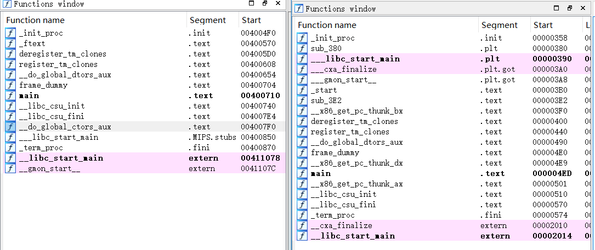

尽管 MIPS 架构和 x86 架构不同，但是基于不同平台的 Linux 上 elf 文件的格式是大体相同的。我们是不是可以将 x86 中编译好的文件进行操作，提取其中的符号和数据，相关的 x86 汇编翻译成 MIPS 汇编，再重新编译，得到可以在 MIPS-Linux 上运行的 ELF 文件呢？这其实看上去蛮有趣的，实际的操作性如何呢？

<!--more-->

我们以最简单的一个程序为例吧，源代码如下：

```c
int main(){
    return 0;
}
```

在之前的博客中有一些编译方法，我们编译之后得到了 `hello-mips` 和 `hello-i386` 这两个文件。拖入 IDA 中反汇编。



可以看到，他们之间还真挺不同的（笑）。我们不考虑编译时附加的函数，只考虑我们写的 main 函数，翻译思路时=是什么样的呢？

在 i386 的 main 函数中，我们看到有如下指令：

```assembly
.text:000004ED ; __unwind {
.text:000004ED                 push    ebp
.text:000004EE                 mov     ebp, esp
.text:000004F0                 call    __x86_get_pc_thunk_ax
.text:000004F5                 add     eax, 1AE7h
.text:000004FA                 mov     eax, 0
.text:000004FF                 pop     ebp
.text:00000500                 retn
.text:00000500 ; } // starts at 4ED
```

这里面有一个 `__x86_get_pc_thunk_ax` 函数，经查询[^1]是由于栈保护引起的，因此我们要编译时加入参数（`-fno-pie`）。这回得到一个比较舒服的 main 汇编：

```assembly
.text:000004ED                 push    ebp
.text:000004EE                 mov     ebp, esp
.text:000004F0                 mov     eax, 0
.text:000004F5                 pop     ebp
.text:000004F6                 retn
```

如果 main 函数不用 C 语言表示而是用内联汇编表示呢？

其实这个几乎不需要写任何的内联汇编。。不过为了演示，我还是写了一句话：

```c
int main(){
    __asm__(
        "movl $0, %eax\n\t"
    );
}
```

嗯。。简直不能再沙雕，它的 main 汇编是这样的：

```assembly
push    ebp
mov     ebp, esp
mov     eax, 0
mov     eax, 0
pop     ebp
retn
```

不过。。我们是否可以也写一个相应的内联汇编，形式为 x86 翻译成 MIPS 的呢？

在这之前，我们看一下 MIPS 汇编的情况吧。对于上述最简单的一个程序，它的 main 汇编是这样子的：

```assembly
var_4= -4
addiu   $sp, -8
sw      $fp, 8+var_4($sp)
move    $fp, $sp
move    $v0, $zero
move    $sp, $fp
lw      $fp, 8+var_4($sp)
addiu   $sp, 8
jr      $ra
nop
```

如果不考虑函数的压栈进栈操作，只考虑核心的话应该是这样的：

```assembly
move $v0, $zero
```

因此我们可以写成这样的形式：

```c
int main(){
    asm(
        "move $v0, $zero"
    );
}
```

接下来我们稍微加大一点难度。我仿照 nemu 中 `/nexus-am/tests/cputests` 中的测试数据，用 sum.c（代码如下）

```c
int main()
{
    int i = 1;
    volatile int sum = 0;
    while (i <= 100)
    {
        sum += i;
        i++;
    }
    return 0;
}
```

编译后的汇编代码如下（i386）：

```assembly
.text:000004F3                 mov     [ebp+var_4], 1
.text:000004FA                 mov     [ebp+var_8], 0
.text:00000501                 jmp     short loc_512
.text:00000503 ; ---------------------------------------------------------------------
.text:00000503
.text:00000503 loc_503:                                ; CODE XREF: main+29↓j
.text:00000503                 mov     edx, [ebp+var_8]
.text:00000506                 mov     eax, [ebp+var_4]
.text:00000509                 add     eax, edx
.text:0000050B                 mov     [ebp+var_8], eax
.text:0000050E                 add     [ebp+var_4], 1
.text:00000512
.text:00000512 loc_512:                                ; CODE XREF: main+14↑j
.text:00000512                 cmp     [ebp+var_4], 64h ; 'd'
.text:00000516                 jle     short loc_503
```

这个内联汇编可以写成什么呢？

上述汇编是

# 内联汇编格式


# About

[^1]: [How do i get rid of call	__x86.get_pc_thunk.ax](https://stackoverflow.com/questions/50105581/how-do-i-get-rid-of-call-x86-get-pc-thunk-ax)